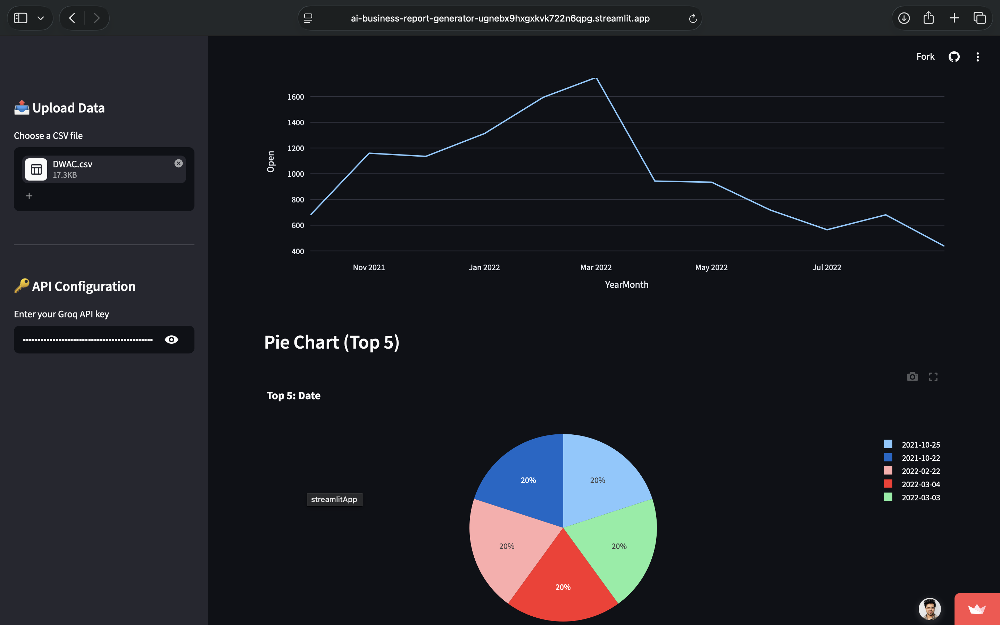

gi<div align="center">

# 🤖 AI Business Report Generator

[](https://www.python.org/downloads/)
[](https://streamlit.io)
[](https://www.sqlite.org/)

[](https://ai-business-report-generator-ugnebx9hxgxkvk722n6qpg.streamlit.app/)

[Overview](#overview) •
[Features](#-features) •
[Tech Stack](#-tech-stack) •
[Installation](#-installation) •
[Troubleshooting](#-troubleshooting)

</div>

---

## Overview

An **AI-powered business analytics platform** that transforms raw datasets into actionable insights with advanced SQL analytics, interactive visualizations, simple forecasting, and professional PDF reports.

**Upload any CSV dataset** → Get **instant analysis** with SQL queries, AI insights, forecasting, and downloadable reports. Perfect for retail, finance, HR, marketing, and operations data.

---

## 🎯 What Makes This Different

- ✅ **Advanced SQL Analytics** - Window Functions (RANK, ROW_NUMBER, LAG/LEAD), CTEs, and aggregations
- ✅ **Smart Data Detection** - Automatically identifies data structure and runs relevant analyses
- ✅ **Real-time AI Insights** - Groq API integration for business context, not just raw analysis
- ✅ **Simple Forecasting** - Linear trend forecasting with interactive Plotly charts and projected values
- ✅ **Professional PDF Reports** - Stakeholder-ready exports with SQL results + AI recommendations + forecast
- ✅ **No Configuration Needed** - Upload and analyze in seconds
- ✅ **Database Support** - CSV, SQLite, PostgreSQL, MySQL ready

---

## 📸 App Demo



---

## ✨ Features

### 📤 Multi-Source Data Import

- Upload CSV datasets directly
- Connect to SQLite databases
- PostgreSQL/MySQL support (ready for integration)
- Automatic data profiling and validation

### 📊 Intelligent Data Quality Assessment

- **Dataset Overview**: Row count, column count, unique values
- **Missing Value Detection**: Automatically removes fully empty columns and columns with 70%+ missing values
- **Duplicate Detection**: Auto-removes duplicate rows on upload
- **Column Profiling**: Data types, cardinality, null counts
- **Smart Imputation**: Fills remaining numeric missing values with median, categorical with "Unknown"
- **Outlier Detection**: Smart IQR-based outlier identification per column

### 🗄️ Advanced SQL Analytics 

Demonstrates mastery of enterprise SQL concepts:

#### Query 1: Ranking Analysis (Window Functions)

```sql
ROW_NUMBER() OVER (ORDER BY SUM(sales) DESC) as rank
ROUND(100.0 * SUM(sales) / (SELECT SUM(sales) FROM data)) as percentage_of_total
```
- **Concept**: Window Functions for ranking without gaps
- **Use Case**: Identify top-performing products, regions, or customers
- **Business Value**: Quick performance comparison with percentile analysis

#### Query 2: Segmentation (Common Table Expressions)

```sql
WITH stats AS (...),
segmentation AS (...)
SELECT * FROM segmentation
```
- **Concept**: Multi-step CTEs for complex data transformation
- **Use Case**: Segment high/low performers, tier customers by value
- **Business Value**: Actionable customer segmentation for targeted strategies

#### Query 3: Trend Analysis (LAG/LEAD Functions)

```sql
LAG(value) OVER (ORDER BY date) as previous_value
(current_value - previous_value) / previous_value * 100 as pct_change
```
- **Concept**: Row-by-row comparisons for time-series analysis
- **Use Case**: Detect trends, anomalies, growth patterns
- **Business Value**: Identify inflection points and seasonality

### 📈 Interactive Visualizations

- **Bar Charts**: Top performers and categories
- **Line Charts**: Trends over time with monthly aggregation
- **Pie Charts**: Distribution analysis
- **Correlation Heatmaps**: Identify relationships between numeric variables
- **Auto-scaling**: Charts adapt to data structure

### 📉 Statistical Analysis

- **Descriptive Statistics**: Mean, median, std dev, quartiles
- **Coefficient of Variation (CV)**: Measure relative volatility
- **Correlation Matrix**: Identify strong relationships (>0.7)
- **Distribution Analysis**: Understand data spread and outliers

### 🤖 AI-Powered Business Insights

**Powered by**: Groq API + Llama 3.1 8B Instruct Model

The AI analyzes your data and generates:
- **Business Domain Detection**: Automatically identifies data type (retail, HR, finance, etc.)
- **Key Findings**: 3-4 critical observations from metrics
- **Risk Identification**: Potential business problems or data quality issues
- **Actionable Recommendations**: Specific, prioritized next steps

### 🔮 Simple Forecasting

Auto-detects date and numeric columns and generates a linear trend forecast:

- **Method**: Linear regression using NumPy (`np.polyfit`) — the same method analysts use for trendlines in Excel
- **Input**: Select any numeric column + choose how many months ahead to forecast (1–12)
- **Output**:
  - Interactive Plotly line chart showing Actual vs Forecast
  - Table of forecasted values by month
  - Projected change % metric
- **Included in PDF report**: Forecast values are automatically added to the downloadable report
- **No extra libraries needed**: Built entirely with NumPy and Pandas

### 📄 Professional PDF Reports

One-click generation of stakeholder-ready reports containing:
- Dataset overview and structure
- SQL analysis results (top categories, segments)
- Statistical metrics and correlations
- AI-generated business context and recommendations
- Forecast values by month (if forecasting was run)
- Automatically timestamped with download

---

## 🛠️ Tech Stack

### Frontend & Framework

- **Streamlit** - Interactive web app framework
- **Python 3.9+** - Core language

### Data Processing & Analysis

- **Pandas** - Data manipulation and transformation
- **NumPy** - Numerical computations and linear trend forecasting

### Visualization

- **Plotly Express** - Interactive, professional charts
- **Correlation Analysis** - Statistical visualization

### Database & SQL

- **SQLite** - Local database support (in-memory for CSV)
- **Advanced SQL**: Window Functions, CTEs, Aggregations, Joins
- **SQL Engines**: PostgreSQL, MySQL ready

### Artificial Intelligence

- **Groq API** - Fast inference platform
- **Llama 3.1 8B Instruct** - Open-source LLM for business analysis

### Reporting

- **FPDF2** - PDF generation with formatting

### Deployment

- **Streamlit Cloud** - Live app hosting (serverless)
- **GitHub** - Version control and CI/CD

---

## 🚀 How to Use

### Quick Start (Live App)

1. **Open**: [Live Demo](https://ai-business-report-generator-ugnebx9hxgxkvk722n6qpg.streamlit.app/)
2. **Upload**: CSV file or connect to database
3. **Explore**: Data quality, SQL insights, statistics, visualizations
4. **Forecast**: Go to Forecasting tab, select a column, choose months ahead
5. **Generate**: Click "Generate AI Insights" for business recommendations
6. **Download**: PDF report with all analysis including forecast

### Local Setup

See [Installation](#-installation) section below.

---

## ⚙️ Installation

### Prerequisites

- Python 3.9 or higher
- pip package manager
- Groq API key (free tier available)

### Step-by-Step

1. **Clone the repository**:
```bash
git clone https://github.com/aditya-pandey-data/AI-Business-Report-Generator.git
cd AI-Business-Report-Generator
```

2. **Create virtual environment**:
```bash
python -m venv venv
```

3. **Activate virtual environment**:

**Windows**:
```bash
venv\Scripts\activate
```

**Mac/Linux**:
```bash
source venv/bin/activate
```

4. **Install dependencies**:
```bash
pip install -r requirements.txt
```

5. **Get Groq API Key** (free):
- Go to https://console.groq.com
- Sign up or login
- Create API key in settings
- Copy your key

---

## ▶️ Running the Application

### Local Development

```bash
streamlit run app.py
```

App opens at: `http://localhost:8501`

### Production (Streamlit Cloud)

- Push code to GitHub
- Go to https://share.streamlit.io
- Connect your GitHub repo
- App deploys automatically

---

## 🔑 API Configuration

### Getting a Groq API Key

1. Visit https://console.groq.com
2. Create account (free)
3. Navigate to API Keys section
4. Generate new API key
5. Copy and paste in app sidebar

**Note**: Free tier includes generous rate limits perfect for portfolio projects.

---

## 📁 Project Structure

```
AI-Business-Report-Generator/
│
├── app.py                    # Main Streamlit application
├── requirements.txt          # Python dependencies
├── README.md                 # Project documentation
├── app-demo.png             # Demo screenshot
├── .gitignore               # Git ignore rules
└── .git/                    # Version control
```

### Key Files

- **app.py** (600+ lines)
  - Data quality validation and smart missing value handling
  - Advanced SQL query generation & execution
  - Statistical analysis
  - Linear trend forecasting
  - AI integration
  - PDF report generation

---

## 📊 Supported Data Types

### Data Formats

- ✅ CSV files
- ✅ SQLite databases
- 🔜 PostgreSQL (ready to implement)
- 🔜 MySQL (ready to implement)

### Data Size

- Tested with 125,000+ rows
- Handles multiple numeric columns
- Optimized for retail, HR, finance, marketing datasets

### Sample Datasets

Works best with:
- **Retail**: Sales, inventory, transactions (product, store, sales, quantity)
- **Finance**: Revenue, expenses, accounts (date, amount, category)
- **HR**: Employees, salaries, departments (name, salary, department)
- **Marketing**: Campaigns, channels, ROI (campaign, channel, spend, revenue)

---

## 🎓 Learning Outcomes

This project demonstrates:

### Data Skills

- ✅ Advanced SQL (Window Functions, CTEs, LAG/LEAD)
- ✅ Pandas data manipulation and analysis
- ✅ Statistical analysis (correlation, distribution)
- ✅ Data quality validation and profiling
- ✅ Smart missing value handling and deduplication

### Analytics Skills

- ✅ Business metrics and KPI calculation
- ✅ Segmentation and ranking analysis
- ✅ Trend detection and time-series analysis
- ✅ Linear trend forecasting (NumPy polyfit)
- ✅ Actionable insights from raw data

### Tools & Implementation

- ✅ API integration (Groq/LLM)
- ✅ PDF report generation
- ✅ Cloud deployment (Streamlit Cloud)
- ✅ Version control (Git/GitHub)
- ✅ Web app development (Streamlit)

### Professional Skills

- ✅ Stakeholder-ready reporting
- ✅ Automated workflows
- ✅ User experience design
- ✅ Production-ready code

---

## 📄 License

MIT License - See LICENSE file for details

---

## 👨‍💻 Author

**Aditya Pandey** - Data & Business Intelligence Analyst

- **GitHub**: [aditya-pandey-data](https://github.com/aditya-pandey-data)
- **LinkedIn**: [aditya-pandey-analytics](https://linkedin.com/in/aditya-pandey-analytics)
- **Email**: [adityapandey12391@gmail.com](mailto:adityapandey12391@gmail.com)

---

## ❓ Troubleshooting

### Issue: "ModuleNotFoundError"

**Solution**: Make sure virtual environment is activated and dependencies installed
```bash
pip install -r requirements.txt
```

### Issue: "Groq API Error"

**Solution**: Verify API key is correct and has active credits
- Check key at https://console.groq.com/keys
- Ensure key is pasted correctly (no spaces)

### Issue: "SQL query fails"

**Solution**: Ensure your data has:
- At least one numeric column (for Query 2 & 3)
- At least one categorical column (for Query 1)
- A Date column (for Query 3 - trends)

### Issue: "Forecasting tab shows blank"

**Solution**: Ensure your data has:
- At least one date column (named with "date", "time", "month", "year", or "day")
- At least one numeric column
- At least 3 months of data for a meaningful forecast

---

## 📞 Support

For issues, questions, or suggestions:
1. **GitHub Issues**: Create an issue on the repository
2. **Email**: adityapandey12391@gmail.com
3. **LinkedIn**: Message me directly

---